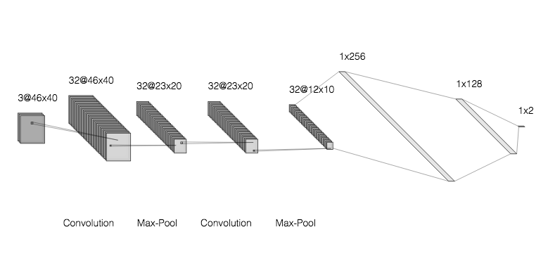

# malaria-detection-deeplearning
Detecting malaria from segmented cell images using CNN in TensorFlow

### Contents

`load_images.py` : Python script to load in cell images, resize, and generate labels. Outputs images and labels as .npy files for modelling.

`cnn_model.py` : Code for convolutional neural network used to classify segmented cells as "Parasitized" or "Uninfected"

### Dataset

The dataset contains a total of 27,558 cell images with equal instances of parasitized and uninfected cells.

Dat can be downloaded from: https://lhncbc.nlm.nih.gov/publication/pub9932

### CNN Model Architecture

### Model Performance

#### Accuracy: 95.2%

|            | precison | recall | f1-score | support |
|------------|----------|--------|----------|---------|
| Uninfected | 0.93     | 0.97   | 0.95     | 2665    |
| Infected   | 0.97     | 0.94   | 0.95     | 2847    |
|            |          |        |          |         |
